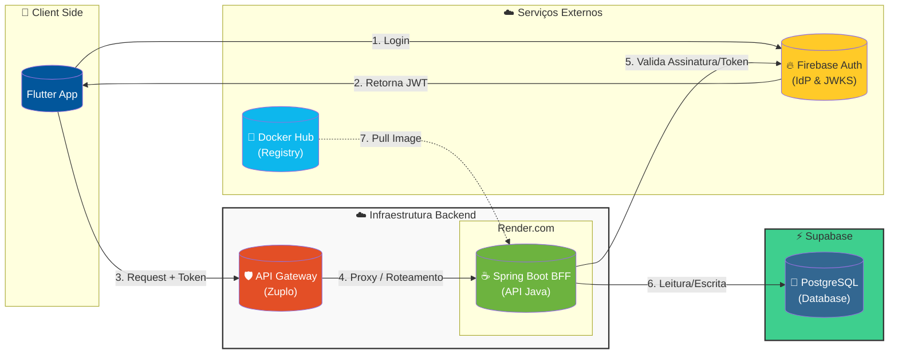

# BFF Bank123

Bem-vindo ao coração da nossa máquina, o BFF (Backend for Frontend) do projeto Bank123.

Pense nele como o meio-campo habilidoso: ele não aparece na foto do gol, mas é ele quem organiza a jogada, pega os dados lá na defesa (banco de dados) e entrega a bola redondinha pro atacante (o aplicativo Flutter) só empurrar pra rede.

Este projeto é feito em **Java 17** com o **Spring Boot**, que é tipo a chuteira nova que a gente usa pra dar show em campo.

## 🚀 Pilha Tecnológica (Nosso Esquema Tático)

-   **Java 17**: O nosso camisa 10, a estrela do time.
-   **Spring Boot**: O nosso técnico, que organiza a casa e deixa tudo pronto pra gente.
-   **Maven**: O roupeiro, que cuida de todas as dependências e garante que ninguém entre em campo com o meião trocado.
-   **PostgreSQL**: O nosso cofre, onde a gente guarda o suado dinheirinho dos nossos clientes.
-   **Firebase Auth**: O segurança da balada. Só entra quem tiver o nome na lista (token JWT válido).
-   **OpenAPI 3.0**: O nosso manual de táticas, com a documentação da API gerada automaticamente.

## 🏗️ Arquitetura e Infraestrutura

Este serviço opera no padrão **BFF (Backend for Frontend)**, servindo como a camada de lógica de negócios e orquestração de dados para a aplicação móvel. Ele foi desenhado para ser **Stateless** e **Containerizado**.

### Visão Geral da Infraestrutura




### 🔒 Segurança e Fluxo de Validação
O backend adota uma postura **Zero Trust**:

1.  **Roteamento:** O serviço não é exposto diretamente à internet pública. Ele recebe tráfego roteado e higienizado pelo **API Gateway (Zuplo)**.
2.  **Validação de Identidade:**
    * Ao receber uma requisição, o Spring Boot intercepta o header `Authorization`.
    * Ele consulta as chaves públicas (JWKS) do **Firebase Auth** para validar a assinatura digital e a validade do Token JWT.
    * Requisições sem token ou com token inválido são rejeitadas com `401 Unauthorized` antes de processar qualquer regra de negócio.

### 🚀 Pipeline de CI/CD e Deploy
A aplicação segue os princípios do **The Twelve-Factor App**:

* **Build:** O código é empacotado via Docker e a imagem é enviada para o **Docker Hub**.
* **Deploy:** O **Render.com** detecta a atualização da imagem e realiza o deploy automático (Zero-downtime deployment).
* **Configuração:** Credenciais de banco e chaves de API são injetadas via Variáveis de Ambiente no container.

### 💾 Persistência de Dados
* **Banco de Dados:** PostgreSQL (Hospedado na **Supabase**).
* **Conexão:** Via JDBC/HikariCP pool.


## 📋 Pré-requisitos

Antes de botar pra rodar, garante que você tem o material de jogo:

1.  **Java 17+ (JDK)**: Se não tiver, a bola nem rola.
2.  **Maven**: Já vem com o nosso wrapper (`mvnw`), então é só usar.
3.  **Docker e Docker Compose**: Para subir o banco de dados PostgreSQL localmente.
4.  **Conta no Firebase**: Você vai precisar de uma conta no Firebase para gerar o arquivo `serviceAccountKey.json`.

## ⚙️ Configuração do Ambiente Local e Credenciais

Para garantir a segurança e facilitar o desenvolvimento, as credenciais e chaves sensíveis são gerenciadas via variáveis de ambiente e arquivos `.gitignore`.

### 1. Banco de Dados PostgreSQL (Docker)

A fonte verdade do esquema do banco de dados está no arquivo `banco-postgres/dump-bank123-v15.sql`. Para subir o banco de dados com a configuração correta:

1.  **Navegue até a pasta `banco-postgres`** no terminal:
    ```bash
    cd banco-postgres
    ```
2.  **Derrube o container existente e apague os volumes de dados (se houver):**
    ```bash
    docker-compose down --volumes
    ```
3.  **Recrie e inicie o container do banco de dados em segundo plano:**
    ```bash
    docker-compose up -d --build
    ```
    Isso criará o container `bank123-postgres` e importará o esquema e os dados iniciais.
4.  **Volte para a raiz do projeto:**
    ```bash
    cd ..
    ```

### 2. Credenciais do Banco de Dados (application.properties)

O arquivo `src/main/resources/application.properties` foi configurado para ler o usuário e a senha do banco de dados de variáveis de ambiente:

```properties
spring.datasource.username=${DB_USERNAME}
spring.datasource.password=${DB_PASSWORD}
```

*   **Para execução via Maven (`./mvnw spring-boot:run`):**
    Defina as variáveis de ambiente antes de executar o comando:
    ```bash
    export DB_USERNAME=bank123
    export DB_PASSWORD=senhabank123
    ./mvnw spring-boot:run
    ```

*   **Para execução via VS Code (`launch.json`):**
    O arquivo `.vscode/launch.json` já está configurado para injetar essas variáveis de ambiente automaticamente para o perfil de debug.

### 3. Senha do PostgreSQL para Docker Compose

O `docker-compose.yml` agora lê a senha do PostgreSQL de um arquivo `.env`:

*   **Crie um arquivo chamado `.env`** na raiz do projeto com o seguinte conteúdo:
    ```
    POSTGRES_PASSWORD=senhabank123
    ```
*   Este arquivo `.env` foi adicionado ao `.gitignore` e **não deve ser versionado**.

### 4. Chave da Conta de Serviço do Firebase (`serviceAccountKey.json`)

*   O arquivo `serviceAccountKey.json` (baixado do seu projeto Firebase) deve ser colocado na pasta `src/main/resources/`.
*   Este arquivo também foi adicionado ao `.gitignore` e **não deve ser versionado** devido à sua natureza sensível. Obtenha-o de forma segura e não o inclua no controle de versão.

### 5. Logs Centralizados com Loki

Para o envio de logs centralizados para o Loki, o `logback-spring.xml` foi configurado para utilizar variáveis de ambiente para as credenciais de autenticação. Isso garante que as informações sensíveis não sejam expostas no código-fonte.

*   **Configuração:**
    As credenciais para o Loki (usuário e senha) são lidas das seguintes variáveis de ambiente:
    ```
    LOKI_USERNAME
    LOKI_PASSWORD
    ```

*   **Para execução via Maven (`./mvnw spring-boot:run`):**
    Defina as variáveis de ambiente antes de executar o comando:
    ```bash
    export LOKI_USERNAME=seu_usuario_loki
    export LOKI_PASSWORD=sua_senha_loki
    ./mvnw spring-boot:run
    ```

*   **Para execução via VS Code (`launch.json`):**
    Adicione as variáveis de ambiente ao seu arquivo `.vscode/launch.json`:
    ```json
    {
        "version": "0.2.0",
        "configurations": [
            {
                // ... outras configurações ...
                "env": {
                    "DB_USERNAME": "bank123",
                    "DB_PASSWORD": "senhabank123",
                    "LOKI_USERNAME": "seu_usuario_loki",
                    "LOKI_PASSWORD": "sua_senha_loki"
                },
                // ... restante da configuração ...
            }
        ]
    }
    ```
    Lembre-se de substituir `seu_usuario_loki` e `sua_senha_loki` pelos valores reais das suas credenciais do Loki.

## ▶️ Como Executar (Apito Inicial)

### Via Maven Wrapper:

```bash
# Lembre-se de definir DB_USERNAME e DB_PASSWORD se não estiver usando o VS Code
export DB_USERNAME=bank123
export DB_PASSWORD=senhabank123
./mvnw spring-boot:run
```

### Via VS Code (Debug):

Para depurar a aplicação diretamente no VS Code, você precisará configurar o arquivo `.vscode/launch.json`. Este arquivo informa ao VS Code como iniciar e anexar o depurador à sua aplicação Java.

Se o arquivo não existir, siga os passos:

1.  Crie uma pasta `.vscode` na raiz do projeto.
2.  Dentro dela, crie um arquivo `launch.json`.
3.  Copie e cole o seguinte conteúdo no arquivo:

```json
{
    "version": "0.2.0",
    "configurations": [
        {
            "type": "java",
            "name": "Bff-bank Local",
            "request": "launch",
            "mainClass": "br.com.fabioalvaro.bank123.bffbank.BffbankApplication",
            "projectName": "bffbank",
            "args": "",
            "env": {
                "DB_USERNAME": "bank123",
                "DB_PASSWORD": "senhabank123"
            },
            "envFile": "${workspaceFolder}/.env"
        }
    ]
}
```

#### O que essa configuração faz?

-   **`"type": "java"`**: Informa que estamos depurando uma aplicação Java.
-   **`"name": "Bff-bank Local"`**: Nome amigável para esta configuração, que aparecerá no menu "Run and Debug".
-   **`"request": "launch"`**: Inicia a aplicação em modo de depuração.
-   **`"mainClass"`**: Aponta para a classe principal que inicia o Spring Boot.
-   **`"env"`**: Injeta as credenciais do banco de dados como variáveis de ambiente, para que você não precise exportá-las manualmente no terminal.

Com o arquivo salvo, para iniciar a depuração:

1.  Abra o painel "Run and Debug" (Ctrl+Shift+D ou Cmd+Shift+D).
2.  Selecione a configuração "Bff-bank Local" no menu.
3.  Clique no botão de iniciar (seta verde).

Se tudo der certo, o serviço vai subir e ficar esperando a bola chegar na porta `8080`.

## ✅ Como Testar (O Jogo-Treino)

Pra ver se a zaga tá firme e o ataque tá afiado, rode nossa bateria de testes:

```bash
./mvnw test
```

## 📖 API

A documentação oficial do BFF, no padrão OpenAPI 3.0, pode ser acessada em tempo real no endereço:
**`http://localhost:8080/v3/api-docs`**

Você pode visualizar e testar os endpoints através da interface amigável do Swagger UI:
**`http://localhost:8080/swagger-ui/index.html`**

Você também pode obter a definição completa da API no formato JSON através do arquivo `bff-bank123-openapi.json`, que é gerado quando a aplicação está rodando.

## 📝 Requisitos Funcionais Implementados

-   **Log de Webhook do Firebase:** Implementado log detalhado no console para o endpoint `/onboarding/v1/webhook-firebase-add`. Agora são registrados o REQUEST (Headers e Body) e o RESPONSE (Status Code, Headers e Body) para rastreabilidade completa. (20/12/2025)
-   **Criação Automática de Conta (Onboarding):** Ao receber o webhook do Firebase em `/onboarding/v1/webhook-firebase-add`, o sistema agora cria automaticamente um registro na tabela `contas` com os dados do usuário (email, uid do Firebase), define o status como 'ativa', saldo zero e gera um novo número de conta sequencial. Além disso, atribui automaticamente as *Custom Claims* dentro do namespace `bank123/jwt/claims` contendo: `numeroconta`, `default_role` (cliente_pf), `allowed_roles` (['cliente_pf']) e `scope` (read:saldo read:extrato write:transacoes read:perfil). (20/12/2025)
-   **Busca de Perfil por E-mail:** O endpoint de perfil (`/bff-bank123/usuario/v1/perfil`) foi alterado para buscar o usuário através do header `x-email-firebase`, permitindo a recuperação dos dados da conta e do perfil (se houver) usando o e-mail como identificador principal. (20/12/2025)
